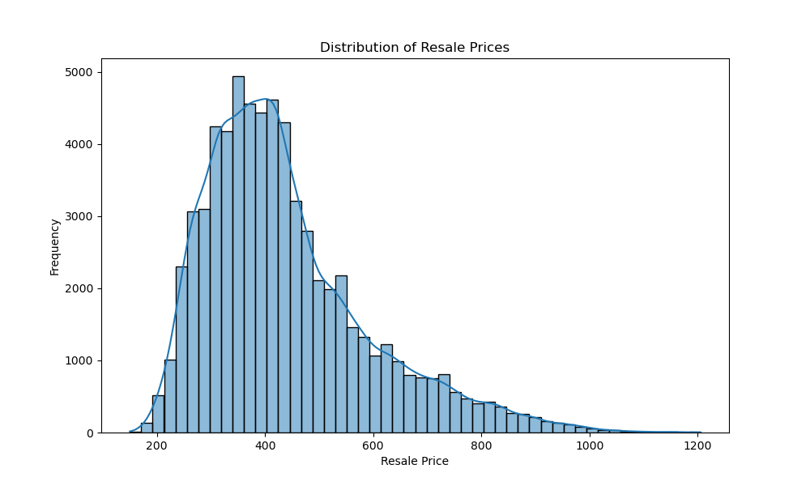
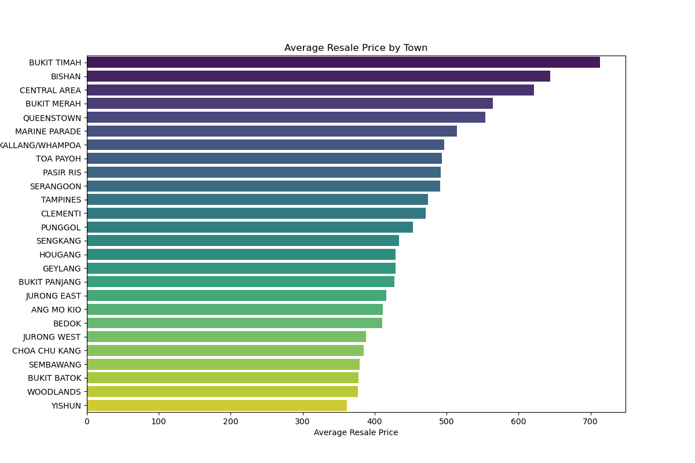
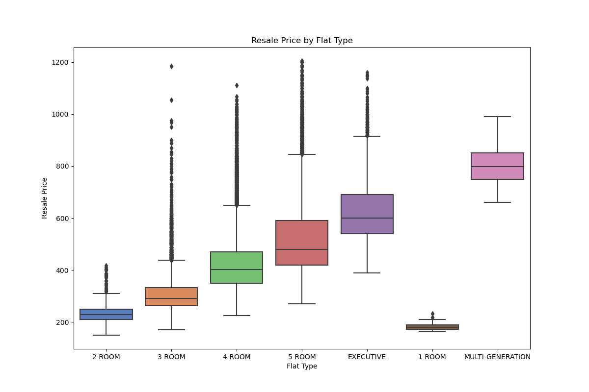
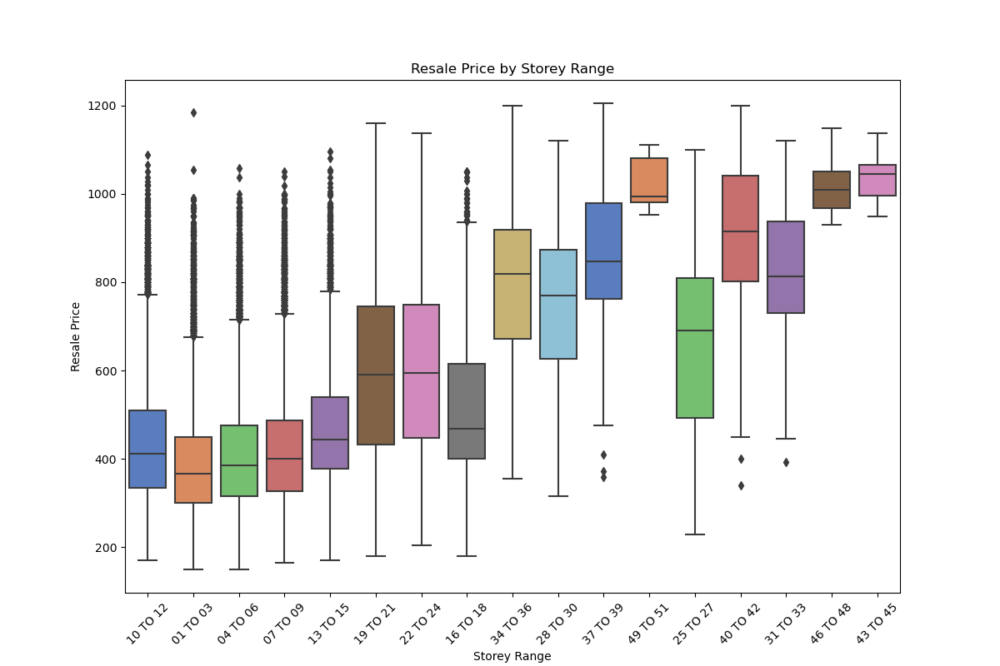
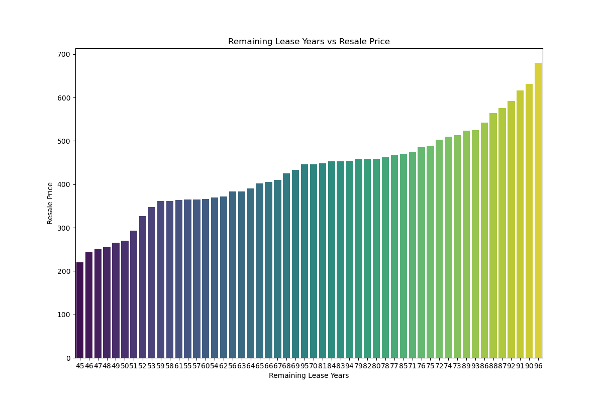

# Analysing and Predicting Resale Housing Prices Using Python

## Tools used: Python Pandas, Matplotlib, Seaborn

In this project, I dived into a dataset of resale housing prices in Singapore (2017-2020) and employed data analysis and machine learning techniques to understand and predict these prices. The project involved data cleaning, exploratory data analysis (EDA), model building, and evaluation.

The dataset used here contains information on resale prices of housing units across different towns in Singapore. The data was inspected and some data cleaning tasks were performed, including converting the 'month' column to the correct date format, converting 'resale_price' to thousands for easier interpretation, and extracting 'remaining_lease_years' from 'remaining_lease' for analysis.

## Exploratory data analysis

EDA was then performed using Python's data analysis libraries such as Pandas, Matplotlib, and Seaborn. The following visualisations were created.

## Model building and evaluation

To prepare for machine learning, unnecessary columns were dropped. Categorical variables were one-hot encoded. Next, the data was split into training and testing sets to train a RandomForestRegressor model. After training the model, predictions were made on the test set and the model's performance was evaluated using Mean Squared Error (MSE), Root Mean Squared Error (RMSE), and R-squared.

Mean Squared Error: 1335.8902159520185
Root Mean Squared Error: 36.54983195518166
R-squared: 0.9437443839206258

The RandomForestRegressor model demonstrated strong predictive performance with an R-squared value of 0.94 on the test set.
